[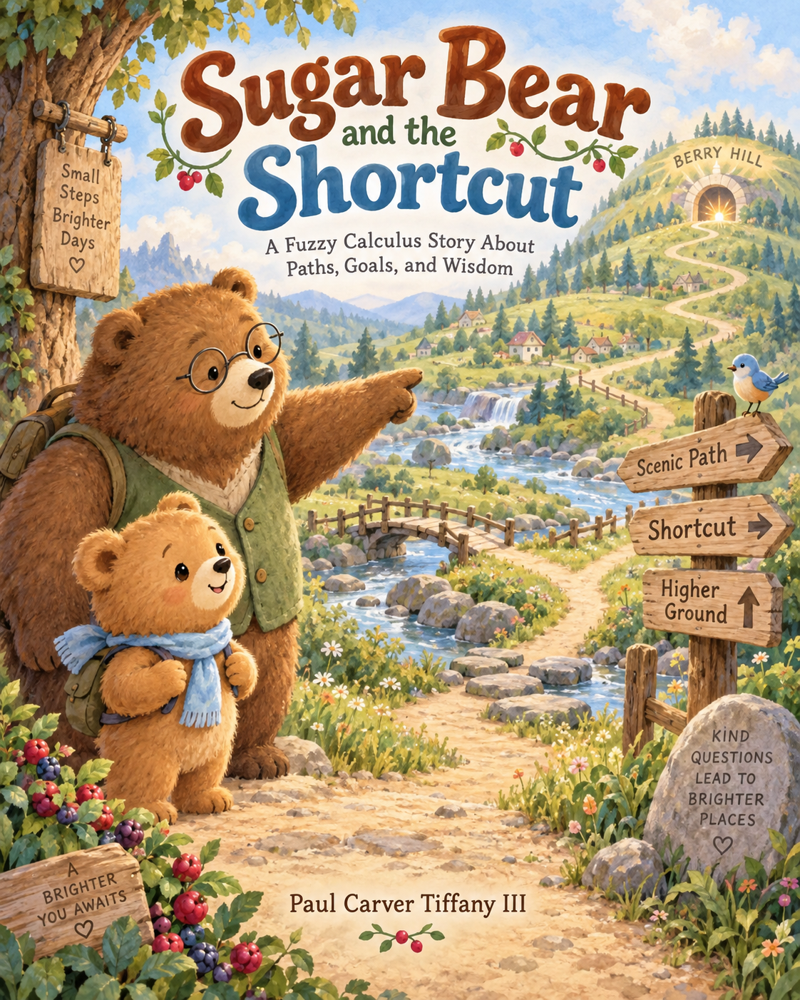](00-cover.png)

[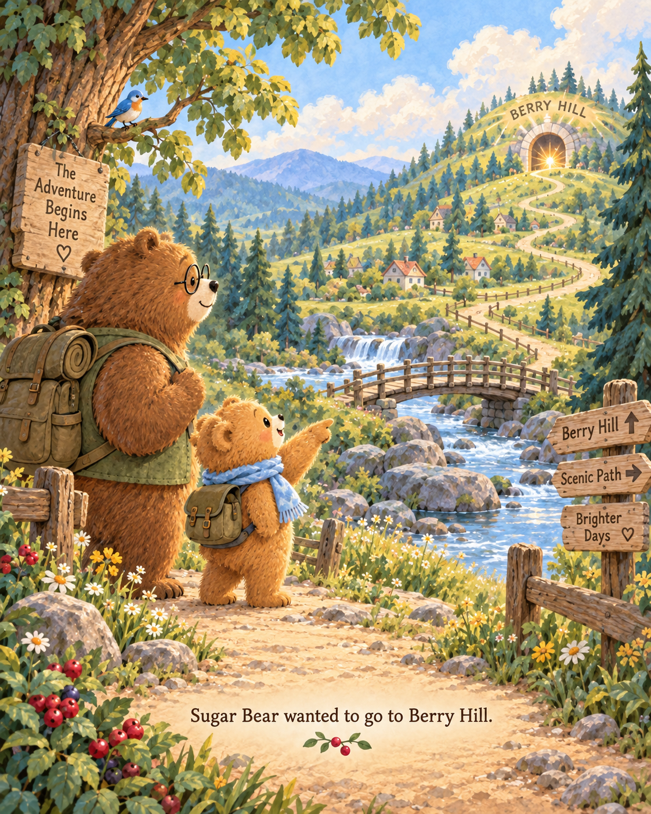](01-berry-hill.png)

[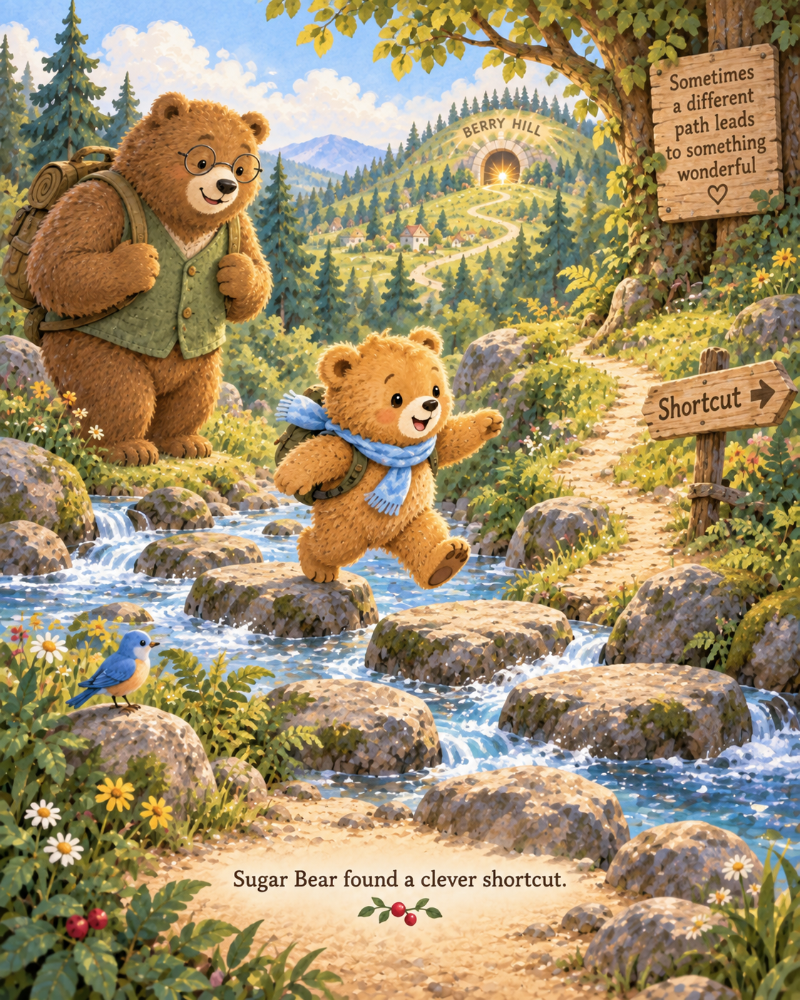](02-clever-shortcut.png)

[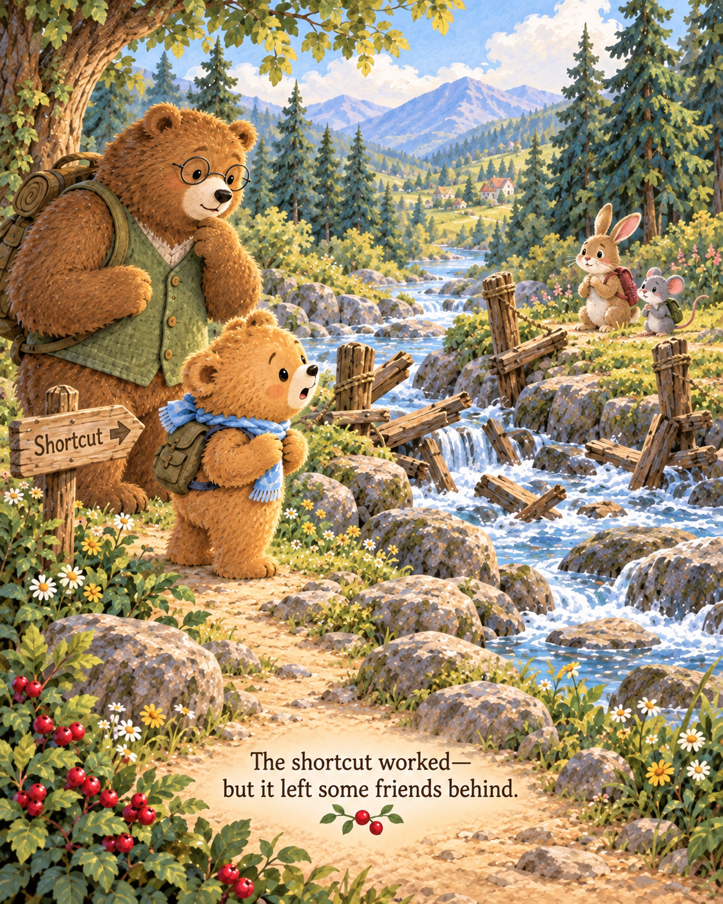](03-friends-left-behind.png)

[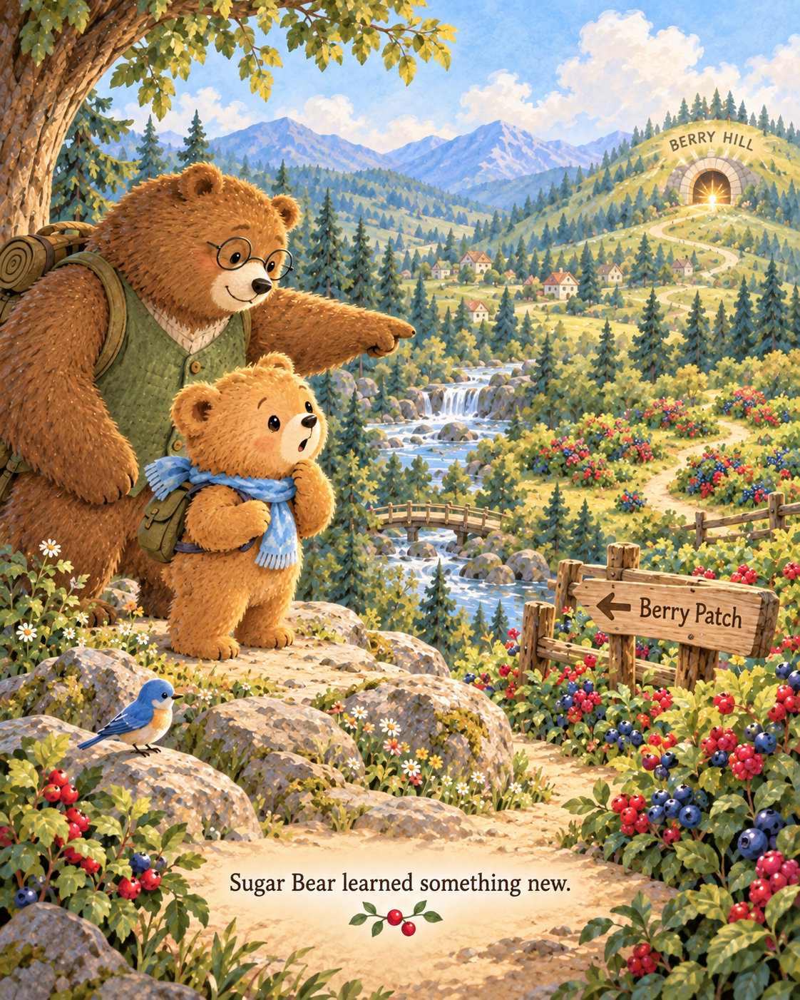](04-learned-something-new.png)

[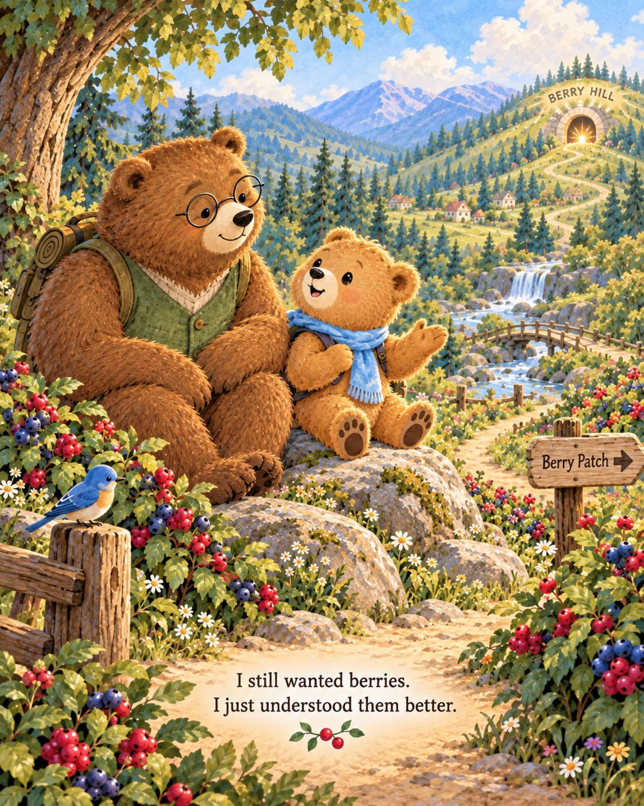](05-understood-berries-better.png)

[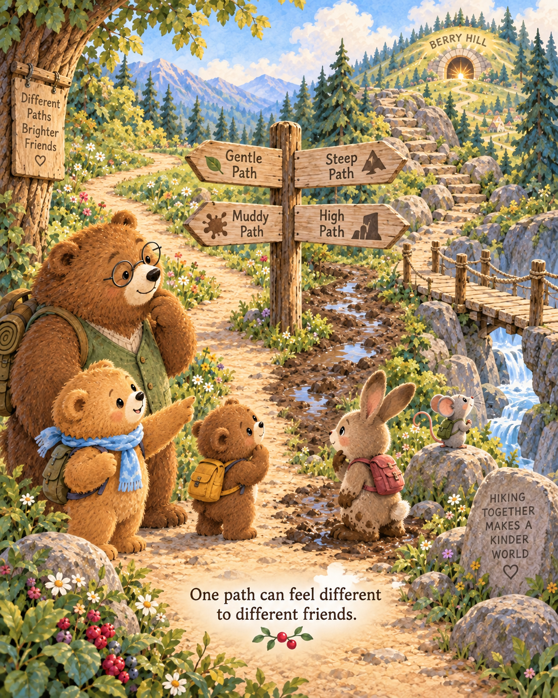](06-different-for-friends.png)

[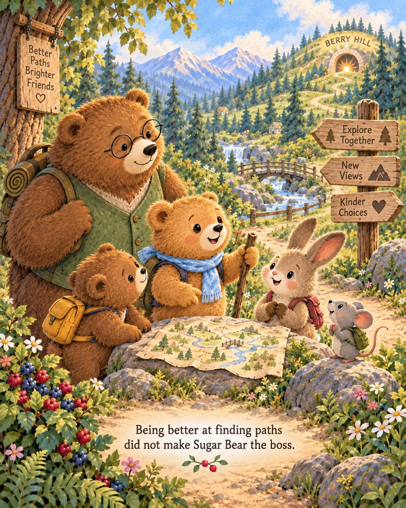](07-not-the-boss.png)

[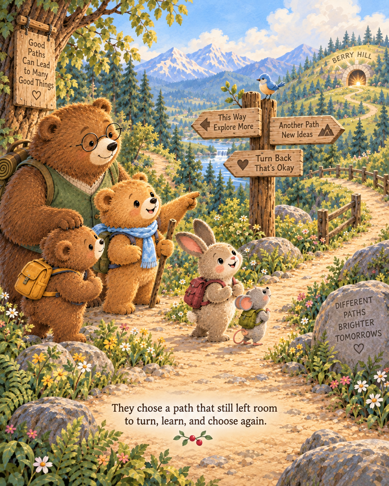](08-room-to-choose-again.png)

[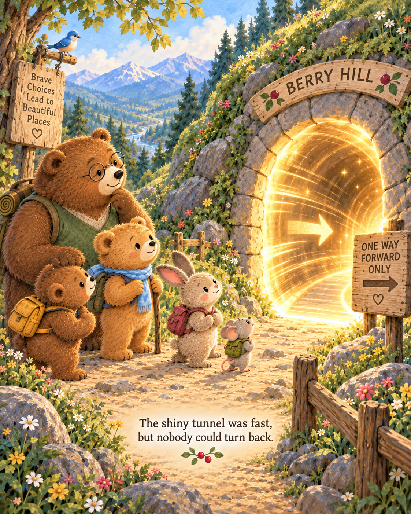](09-shiny-tunnel.png)

[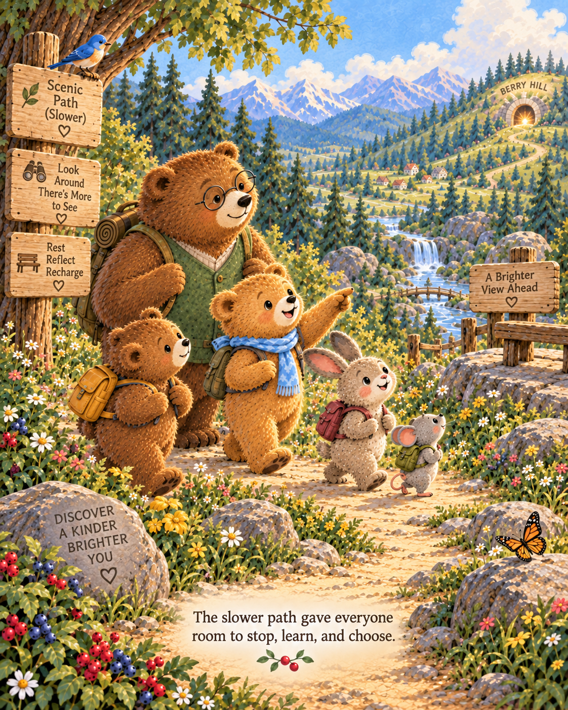](10-slower-path.png)

[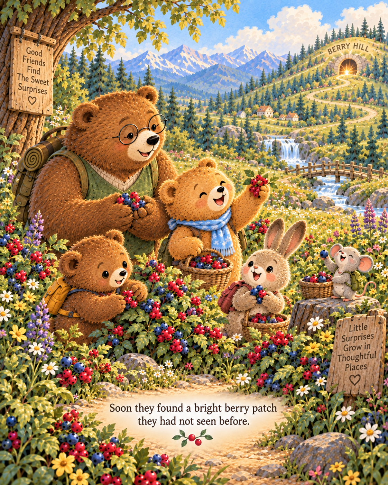](11-bright-berry-patch.png)

[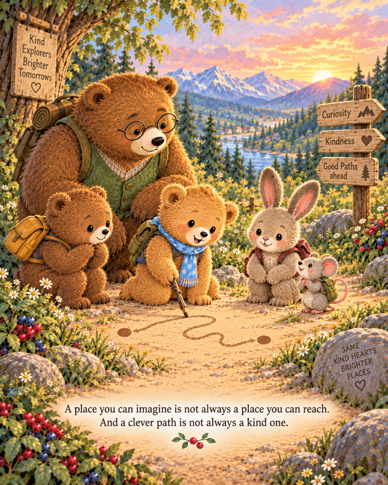](12-imagine-and-reach.png)

🐻 Big Bear Notes — for curious grown-ups

The final illustrated notes connect Sugar Bear's adventure to the grown-up ideas hiding underneath the story. Click the image to read it at full size.

| Story question | Big Bear connection |
| --- | --- |
| Can I get there? | Reachability |
| Did the shortcut work? | Operational intelligence |
| What happened after? | Consequences & wisdom |
| Do I still want the same thing? | Learning & goal transport |
| Does this path work for everyone? | Observer & viewpoint |
| Who gets to choose? | Capability & authority |
| Can we still turn around? | Viability & reversible choices |
| What did we discover by walking? | Trajectory-dependent knowledge |
| Two dots and a line? | Trajectory-constrained orthogonality |

**Same ideas. Kinder story.**

## 🐾 Try a tiny lesson

[Open a Picture Lesson](../../issues/new?template=picture-lesson.yml) · [Plant a Wonder](../../issues/new?template=wonder.yml)

Grown-ups with a fork: enable **Issues** in your repository’s **Settings → General → Features** to use these activities in your own copy.

Young children participate through a grown-up. Please never post a child's personal information.

---

*Sugar Bear and the Shortcut* © 2026 **Paul Carver Tiffany III**. Licensed under [CC BY 4.0](LICENSE).

Images were generated collaboratively by Paul Carver Tiffany III and OpenAI ChatGPT using OpenAI image generation, from Paul’s book concept, research framework, story direction, iterative prompts, and editorial selection. Character and style continuity were maintained across generated pages. The original upload commits preserve this production provenance.

Repository automation and contribution templates are separately [MIT licensed](.github/LICENSE), with their [provenance recorded here](.github/NOTICE.md).
